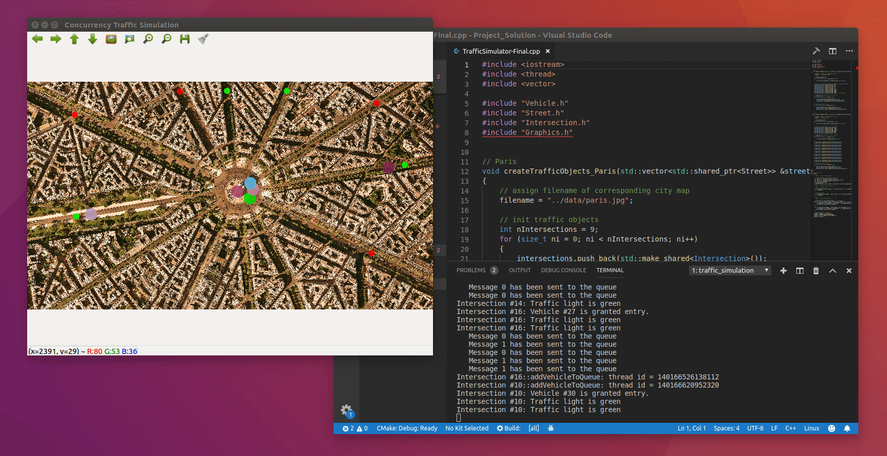

# CPPND: Concurrent Traffic Simulator
This is the project for the Concurrency course in the Udacity C++ Nanodegree Program.  



> [!NOTE]  
> This program is designed to run in headless environments. This gif demonstrates how the output video and logs correlate. When ran, this program will output logs in real-time but save the video.

Throughout the Concurrency course, you have been developing a traffic simulation in which vehicles are moving along streets and are crossing intersections. However, with increasing traffic in the city, traffic lights are needed for road safety. Each intersection will therefore be equipped with a traffic light. In this project, you will build a suitable and thread-safe communication protocol between vehicles and intersections to complete the simulation. Use your knowledge of concurrent programming (such as mutexes, locks and message queues) to implement the traffic lights and integrate them properly in the code base.

# Project Setup

## 1. Install Dependencies
> [!NOTE]  
> If you're using Udacity Workspace, these dependencies are already installed
* At least 100MB of free space
* cmake >= 2.8
  * All OSes: [click here for installation instructions](https://cmake.org/install/)
* make >= 4.1 (Linux, Mac), 3.81 (Windows)
  * Linux: make is installed by default on most Linux distros
  * Mac: [install Xcode command line tools to get make](https://developer.apple.com/xcode/features/)
  * Windows: [Click here for installation instructions](http://gnuwin32.sourceforge.net/packages/make.htm)
* OpenCV >= 4.1
  * The OpenCV 4.1.0 source code can be found [here](https://github.com/opencv/opencv/tree/4.1.0)
* gcc/g++ >= 5.4
  * Linux: gcc / g++ is installed by default on most Linux distros
  * Mac: same deal as make - [install Xcode command line tools](https://developer.apple.com/xcode/features/)
  * Windows: recommend using [MinGW](http://www.mingw.org/)

## 2. Compile, build, and Run
> [!IMPORTANT]  
> The code will compile but not build until the code is successfully completed
1. Clone this repo.
2. Make a build directory in the top level directory: `mkdir build && cd build`
3. Compile: `cmake .. && make`
4. Run it: `./traffic_simulation`


### Command Line Options
> [!IMPORTANT]  
> GitHub restricts file uploads to 100MB. When submitting, we highly recommend using the default options, as these are designed to keep the video file within that limit.
```
./traffic_simulation [options]
Options:
  --city <name>      City map to use (paris or nyc, default: paris)
  --output <file>    Output video file (default: traffic_simulation.mp4)
  --duration <sec>   Simulation duration in seconds (default: 30)
  --vehicles <num>   Number of vehicles (default: 6)
  --help             Show this help message
```

### Examples

Generate a 30-second video of Paris traffic:
```
./traffic_simulation --output paris_traffic.mp4 --duration 30
```

Generate a 60-second video of NYC traffic with 10 vehicles:
```
./traffic_simulation --city nyc --output nyc_traffic.mp4 --duration 60 --vehicles 10
```

# Project Tasks
> [!TIP]  
> You can find where these tasks are by searching for `TODO` or `FP.` in `Intersection.cpp`, `TrafficLight.cpp` and `TrafficLight.h`

When you are finished with the project, your traffic simulation should run with red lights controlling traffic, just as in the .gif file above. See the classroom instruction and code comments for more details on each of these parts. 

- **Task FP.1** : Define a class `TrafficLight` which is a child class of `TrafficObject`. The class shall have the public methods `void waitForGreen()` and `void simulate()` as well as `TrafficLightPhase getCurrentPhase()`, where `TrafficLightPhase` is an enum that can be either `red` or `green`. Also, add the private method `void cycleThroughPhases()`. Furthermore, there shall be the private member `_currentPhase` which can take `red` or `green` as its value.
- **Task FP.2** : Implement the function with an infinite loop that measures the time between two loop cycles and toggles the current phase of the traffic light between red and green and sends an update method to the message queue using move semantics. The cycle duration should be a random value between 4 and 6 seconds. Also, the while-loop should use `std::this_thread::sleep_`for to wait 1ms between two cycles. Finally, the private method `cycleThroughPhases` should be started in a thread when the public method `simulate` is called. To do this, use the thread queue in the base class.
- **Task FP.3** : Define a class `MessageQueue` which has the public methods send and receive. Send should take an rvalue reference of type TrafficLightPhase whereas receive should return this type. Also, the class should define an `std::dequeue` called `_queue`, which stores objects of type `TrafficLightPhase`. Finally, there should be an `std::condition_variable` as well as an `std::mutex` as private members.
- **Task FP.4** : Implement the method `Send`, which should use the mechanisms `std::lock_guard<std::mutex>` as well as `_condition.notify_one()` to add a new message to the queue and afterwards send a notification. Also, in class `TrafficLight`, create a private member of type `MessageQueue` for messages of type `TrafficLightPhase` and use it within the infinite loop to push each new `TrafficLightPhase` into it by calling send in conjunction with move semantics.
- **Task FP.5** : The method receive should use `std::unique_lock<std::mutex>` and `_condition.wait()` to wait for and receive new messages and pull them from the queue using move semantics. The received object should then be returned by the receive function. Then, add the implementation of the method `waitForGreen`, in which an infinite while-loop runs and repeatedly calls the `receive` function on the message queue. Once it receives `TrafficLightPhase::green`, the method returns.
- **Task FP.6** : In class Intersection, add a private member `_trafficLight` of type `TrafficLight`. In method `Intersection::simulate()`, start the simulation of `_trafficLight`. Then, in method `Intersection::addVehicleToQueue`, use the methods `TrafficLight::getCurrentPhase` and `TrafficLight::waitForGreen` to block the execution until the traffic light turns green.
